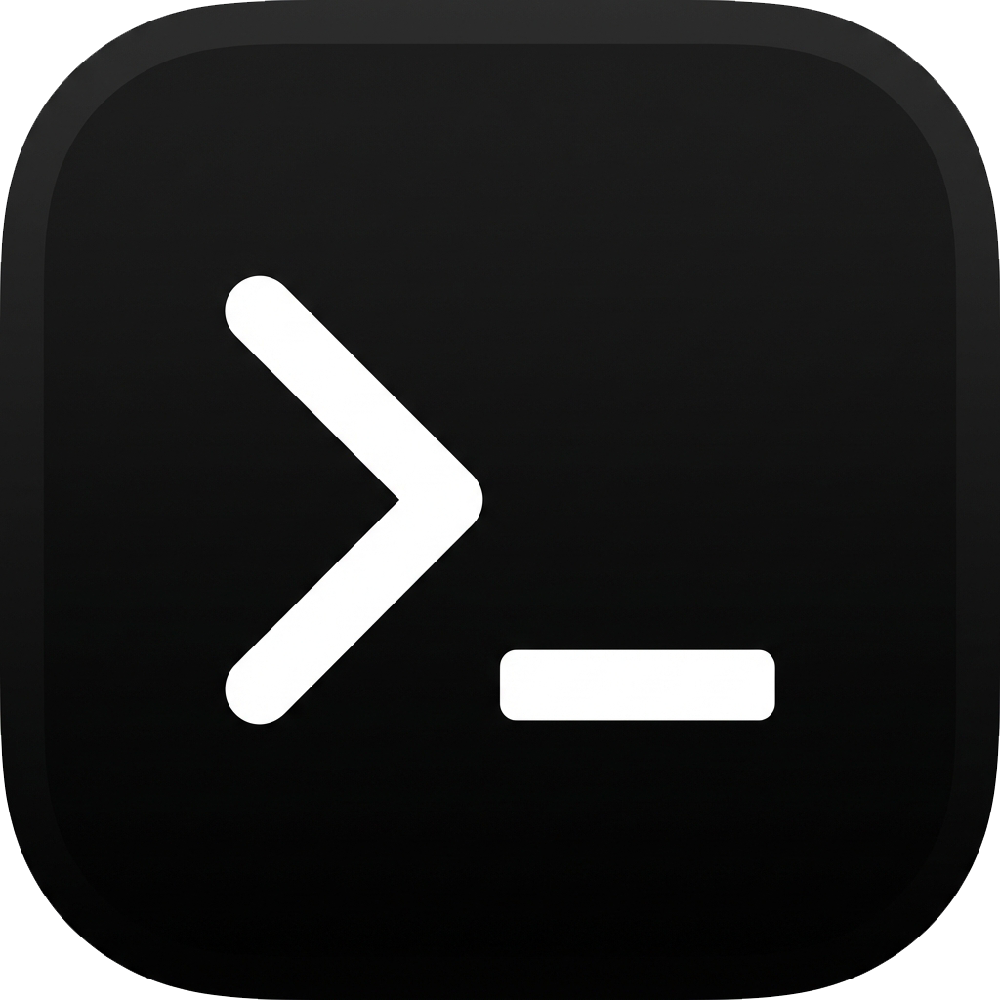

<p align="center">
  
</p>

<h1 align="center">ML Bridge</h1>

<p align="center"> A visual, no-code <b>Machine Learning Studio</b> for creative technologists. Train models on real-time sensor data, webcam feeds, or OSC streams in seconds, and deploy them to <b>TouchDesigner or Max/MSP</b>.</p>

---

## What is ML Bridge?

**ML Bridge** removes the complexity of machine learning for physical computing. Instead of writing Python scripts or managing Jupyter notebooks, you can:
1.  **Connect** your sensors (via Serial Bridge) or Webcam.
2.  **Record** examples by simply holding a button.
3.  **Train** a model in the browser (Instant KNN or Neural Network).
4.  **Run** live inference to control your art, robots, or visuals.

It is designed to sit perfectly between **Serial Bridge** (for hardware data) and your creative output.

## Table of Contents

- [Features](#features)
- [The Two Workflows](#the-two-workflows)
- [Installation](#installation)
- [Quick Start](#quick-start)
- [Concepts & Deep Dive](#concepts--deep-dive)
  - [Input Sources](#input-sources)
  - [Classification vs. Regression](#classification-vs-regression)
  - [Temporal Windowing (Gestures)](#temporal-windowing-gestures)
  - [KNN vs. Dense Engines](#knn-vs-dense-engines)
- [Deployment](#deployment)
  - [OSC Output](#osc-output)
  - [Arduino Integration](#arduino-integration)
  - [WebSocket Output](#websocket-output)
- [Troubleshooting](#troubleshooting)

## Features

-   **Universal Input**: Seamlessly ingest data from **Serial Bridge** (Arduino/ESP32), **Webcam** (pixels), or **OSC** (external apps).
-   **Dual Engines**:
    -   **KNN (K-Nearest Neighbors)**: Instant training, zero wait time. Perfect for rapid prototyping.
    -   **Dense (Neural Network)**: A powerful pattern matcher. Best for complex gestures.
-   **Temporal Windowing**: Train **gestures** (swipes, waves, shapes) not just static poses using the built-in time-series buffer.
-   **No-Code Interface**: Add classes, rename labels, and tune hyperparameters with a sleek UI.
-   **Live Visualizers**: Real-time oscilloscope views, confidence meters, and regression bars.
-   **OSC Broadcasting**: Stream prediction results straight to TouchDesigner, Unity, or Max/MSP.

## The Two Workflows

We designed ML Bridge to support two distinct creative workflows:

### 1. The Playground (Rapid Prototyping)
**Goal**: *Make a controller for a p5.js sketch in 5 minutes.*
*   **Engine**: KNN (Instant).
*   **Process**: You hook up an accelerometer. You record "Tilted Left", "Tilted Right", "Flat". You hit train (instantly ready). You map the OSC output to your visual.
*   **Why**: Speed. No compilation, no downloading files. It just works.


### 2. The Interaction (Gesture Recognition)
**Goal**: *Detect a "Magic Swipe" vs a "Circle" motion.*
*   **Feature**: Temporal Windowing.
*   **Process**: You increase the **Temporal Window** slider to `20 frames`. The engine now "sees" video clips of your data instead of photos. You record the motion.
*   **Result**: The system recognizes the *evolution* of the data over time, allowing for complex gesture control.

## Installation


### Download Pre-built Application

Download the latest release for your platform from the [Releases page](https://github.com/IrtizaNasar/ml-bridge/releases).

### macOS Setup

Since this app is not signed by Apple, you may see a warning that it "is damaged and can't be opened." To fix this:

1.  Move the app to your **Applications** folder.
2.  Open Terminal and run:
    ```bash
    xattr -cr /Applications/ML\ Bridge.app
    ```
3.  You can now open the app normally.

### Windows Setup

When you run the installer or executable for the first time, you may see a blue "Windows protected your PC" popup (Microsoft SmartScreen). This happens because the app is not code-signed.

1.  Click **"More info"**.
2.  Click **"Run anyway"**.


### Linux Setup

If you are using the `.AppImage` on Linux (especially Ubuntu 22.04+), you may need to perform a few one-time setup steps.

1.  **Make Executable**: Right-click the `.AppImage` file -> Properties -> Permissions -> Allow executing file as program. Or via terminal:
    ```bash
    chmod a+x ML-Bridge-*.AppImage
    ```

2.  **Install libfuse2 (Ubuntu 22.04+)**: AppImages require FUSE to run.
    ```bash
    sudo apt install libfuse2
    ```

3.  **Sandbox Issues (Ubuntu 24.04+)**: If you see a "SUID sandbox helper binary" error:
    *   Run with `--no-sandbox`:
        ```bash
        ./ML-Bridge-*.AppImage --no-sandbox
        ```
    *   OR enable unprivileged user namespaces (recommended fix):
        ```bash
        sudo sysctl -w kernel.apparmor_restrict_unprivileged_userns=0
        ```

### Build from Source (Advanced)

```bash
# Clone the repository
git clone https://github.com/IrtizaNasar/ml-bridge.git
cd ml-bridge

# Install dependencies
npm install

# Run in development mode
npm run electron:dev

# Build for production
npm run electron:build
```

## Quick Start

### 1. Select Input Source
In the top header, select your data source:
*   **SERIAL BRIDGE**: Auto-connects to the main app (port 3000) to receive sensor data.
*   **WEBCAM**: Uses your camera. ML Bridge automatically crops and downsamples the image.

### 2. Choose Your Mode
*   **Classification**: "Discrete" states (e.g., Sitting, Standing, Jumping).
*   **Regression**: "Continuous" values (e.g., a slider from 0.0 to 1.0 based on how hard you squeeze).

### 3. Record Data
*   **Add Class / Parameter**: Create a bucket for your data (e.g., "Class 1: Neutral").
*   **Hold to Record**: Click and hold the record button while performing the action.
*   *Tip: Try to capture variations (slightly different angles/speeds) for a robust model.*

### 4. Train & Run
*   **KNN**: It's always training! Just click **Run**.
*   **Dense**: Click **"Train Model"**. Watch the Loss curve go down and Accuracy go up.

### 5. Monitor
Switch to the **Deployment** tab (or watch the "Deployment & Monitor" hub). You'll see the live classification and confidence levels.

## Concepts & Deep Dive

### Input Sources

*   **Serial Bridge Link**: The app listens for `serial-data` events from `localhost:3000`. It treats **every numeric value** in the JSON packet as a feature.
    *   *Example*: `{ "x": 10, "y": 20 }` &rarr; Model sees `[10, 20]`.
    *   *Feature Selection*: You can uncheck specific keys in the **Input Card** to ignore noisy sensors.
*   **Webcam**: The image is resized to `64x64`, converted to grayscale, and flattened.
    *   *Note*: This creates 4096 features! Training will be slower than with sensors.

### Classification vs. Regression

| Feature | Classification | Regression |
| :--- | :--- | :--- |
| **Output** | A Label (String) | A Value (Float 0.0 - 1.0) |
| **Use Case**| "Is the door open?" | "How open is the door?" |
| **Engines** | KNN / Dense | KNN / Dense |
| **Visuals** | Confidence Meter | Interactive Bar / Slider |

### Temporal Windowing (Gestures)

Standard ML looks at a **Snapshot** (1 frame). This works for "Poses" (static states).
To detect "Gestures" (movement), you need **Time**.

*   **The Slider**: In "Training Config", increasing the **Temporal Window** (e.g., to 20) creates a buffer.
*   **How it works**: When window = 20, the model receives `[Data_t, Data_t-1, ... Data_t-19]`. It sees the last 20 samples at once.
*   **Trade-off**: Larger windows capture longer gestures but increase "Lag" (latency) because the gesture must finish before it matches the pattern.

### KNN vs. Dense Engines

| Engine | Type | Training Time | Exportable? | Best For... |
| :--- | :--- | :--- | :--- | :--- |
| **KNN** | k-Nearest Neighbors | Instant (0s) | No | Prototyping, Regression, fast experiments. |
| **Dense** | Neural Network | Slow (10s - 2m) | **No** | Complex projects. Can distinguish very similar gestures better than KNN. |

## Deployment

### OSC Output

ML Bridge broadcasts results to `127.0.0.1:12000` (configurable).

**Classification Address**: `/ml/classification`
*   **Args**: `[ClassID (string), ClassName (string)]`
*   **Example**: `/ml/classification` `["class_1", "Neutral"]`

**Regression Address**: `/ml/regression`
*   **Args**: `[OutputID (string), Value (float)]`
*   **Example**: `/ml/regression` `["out_1", 0.75]`

### Arduino Integration

Send predictions directly to Arduino or other microcontrollers via Serial Bridge.

#### Setup

1. Go to **Deploy** tab
2. Select **Serial Bridge** protocol
3. Enter your device ID (e.g., `arduino`)
4. Choose data format: **JSON** (recommended) or **CSV**
   - **JSON is faster** - less parsing overhead, lower latency
   - CSV may have slight lag due to string parsing

#### Connection Methods

**USB Serial (Easiest)**
- Connect Arduino via USB
- Add device in Serial Bridge app
- Use the USB Serial sketch below

**Bluetooth (Wireless)**
- Requires Arduino with BLE (e.g., Uno R4 WiFi, Nano 33 BLE)
- Device advertises as "ML-Bridge-LED"
- Use the Bluetooth sketch below

#### Example: LED Control

Control an LED based on classification predictions (class_1 = ON, class_2 = OFF).

**Wiring:**
- LED positive (long leg) → Pin 2
- LED negative (short leg) → GND (through 220Ω resistor)

**USB Serial Sketch** ([`arduino_serial_led_control.ino`](arduino_serial_led_control.ino)):
```cpp
const int LED_PIN = 2;
String receivedData = "";

void setup() {
  Serial.begin(115200);
  pinMode(LED_PIN, OUTPUT);
  digitalWrite(LED_PIN, LOW);
}

void loop() {
  while (Serial.available() > 0) {
    char c = Serial.read();
    if (c == '\n' || c == '\r') {
      if (receivedData.length() > 0) {
        processData(receivedData);
        receivedData = "";
      }
    } else {
      receivedData += c;
    }
  }
}

void processData(String data) {
  data.trim();
  String label = "";
  
  // Parse JSON: {"label":"class_1","confidence":0.85}
  if (data.indexOf("{") >= 0) {
    int labelStart = data.indexOf("\"label\":\"") + 9;
    int labelEnd = data.indexOf("\"", labelStart);
    if (labelEnd > labelStart) {
      label = data.substring(labelStart, labelEnd);
    }
  }
  // Parse CSV: class_1,0.85
  else if (data.indexOf(",") > 0) {
    label = data.substring(0, data.indexOf(","));
  }
  // Plain label
  else {
    label = data;
  }
  
  // Control LED
  if (label.indexOf("class_1") >= 0) {
    digitalWrite(LED_PIN, HIGH);
  } else if (label.indexOf("class_2") >= 0) {
    digitalWrite(LED_PIN, LOW);
  }
}
```

**Bluetooth Sketch** ([`arduino_bluetooth_led_control.ino`](arduino_bluetooth_led_control.ino)):
```cpp
#include <ArduinoBLE.h>

const int LED_PIN = 2;

BLEService uartService("6E400001-B5A3-F393-E0A9-E50E24DCCA9E");
BLECharacteristic rxCharacteristic("6E400002-B5A3-F393-E0A9-E50E24DCCA9E", BLEWrite, 512);

String receivedData = "";

void setup() {
  Serial.begin(115200);
  pinMode(LED_PIN, OUTPUT);
  
  BLE.begin();
  BLE.setLocalName("ML-Bridge-LED");
  BLE.setAdvertisedService(uartService);
  uartService.addCharacteristic(rxCharacteristic);
  BLE.addService(uartService);
  BLE.advertise();
}

void loop() {
  BLEDevice central = BLE.central();
  
  if (central && central.connected()) {
    if (rxCharacteristic.written()) {
      // Read and process data (same parsing logic as USB version)
      // See full code in arduino_bluetooth_led_control.ino
    }
  }
}
```

**Full code samples available in repository root.**

#### Data Formats

**Classification:**
- JSON: `{"label":"class_1","confidence":0.85}`
- CSV: `class_1,0.85`

**Regression:**
- JSON: `{"out_1":0.48,"out_2":1.00}`
- CSV: `0.48,1.00`

#### Troubleshooting

- **No data received**: Check Serial Bridge is connected and device ID matches
- **LED not responding**: Verify baud rate is 115200 for USB Serial
- **Bluetooth not connecting**: Ensure device name is "ML-Bridge-LED" and BLE is advertising
- **Lag with CSV**: Switch to JSON format for better performance


### WebSocket Output

ML Bridge runs a WebSocket server on `ws://localhost:3100`. It serves a helper library to make connection easy.

**1. Include the Library**:
Add this to your HTML file (before your own script):
```html
<!-- Load Socket.IO -->
<script src="https://cdn.socket.io/4.7.2/socket.io.min.js"></script>
<!-- Load ML Bridge Helper -->
<script src="http://localhost:3100/ml-bridge.js"></script>
```

**2. Use in JavaScript / p5.js**:
```javascript
let ml;
let currentLabel = "Waiting...";

function setup() {
  createCanvas(400, 400);
  
  // Auto-connects to localhost:3100
  ml = new MLBridge();
  
  // Listen for predictions
  ml.onPrediction((data) => {
    if (data.label) {
      currentLabel = data.label + " (" + int(data.confidence * 100) + "%)";
    } else if (data.regression) {
      // Handle Regression
      currentLabel = "";
      for (let key in data.regression) {
        currentLabel += key + ": " + nf(data.regression[key], 1, 2) + "\n";
      }
    }
  });
}

function draw() {
  background(20);
  fill(255);
  textSize(32);
  textAlign(CENTER, CENTER);
  text(currentLabel, width/2, height/2);
}
```


## Troubleshooting

**Q: I'm recording but the graph isn't moving.**
A: Check if the **Serial Bridge** app is running and connected. Verify that `Input Stream` shows "Connected" in green.

**Q: My model predicts "Class 1" for everything.**
A: You might have **imbalanced data**. Ensure you have roughly the same number of samples for each class.

**Q: Regression is jittery.**
A: Regression is sensitive. Increase the number of recorded samples to smooth out the noise, or use the **Temporal Window** (size ~5) to average out input jitter.

**Q: "Dimension Mismatch" Error.**
A: You likely changed the **Input Source** or **Temporal Window** after recording data. The model expects the data shape to always be the same. Clear the model (Trash Icon) and record fresh data.

## License

ML Bridge is dual-licensed:

### Open Source (GPLv3)
*   **Free to use** for personal projects, research, education, and open-source applications.
*   If you distribute a project that uses ML Bridge, you **must also open-source your project under GPLv3**.
*   You must preserve the author's copyright and attribution.

### Commercial License
*   **Required** if you wish to use ML Bridge in a proprietary (closed-source) commercial product.
*   Allows you to keep your source code private.
*   Contact **Irtiza Nasar** (irtizanasar@gmail.com) for commercial licensing inquiries.

Copyright © 2026 Irtiza Nasar. All rights reserved.

