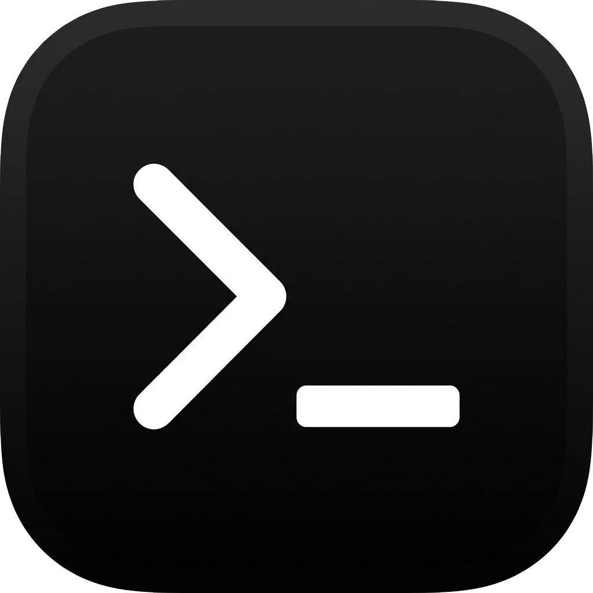

<p align="center">
  
</p>

<h1 align="center">ML Bridge</h1>

<p align="center"> A visual, no-code <b>Machine Learning Studio</b> for creative technologists. Train models on real-time sensor data, webcam feeds, or OSC streams in seconds, and deploy them to <b>TouchDesigner or Max/MSP</b>.</p>

<p align="center">
  <a href="LICENSE">
    
  </a>
</p>

<!--  -->


---

## What is ML Bridge?

**ML Bridge** removes the complexity of machine learning for physical computing. Instead of writing Python scripts or managing Jupyter notebooks, you can:
1.  **Connect** your sensors (via Serial Bridge) or Webcam.
2.  **Record** examples by simply holding a button.
3.  **Train** a model in the browser (Instant KNN or Neural Network).
4.  **Run** live inference to control your art, robots, or visuals.

It is designed to sit perfectly between **Serial Bridge** (for hardware data) and your creative output.

## Table of Contents

- [Features](#features)
- [The Two Workflows](#the-two-workflows)
- [Installation](#installation)
- [Quick Start](#quick-start)
- [App Layout](#app-layout)
- [Your First Project (5 minutes)](#your-first-project-5-minutes)
- [Concepts & Deep Dive](#concepts--deep-dive)
  - [Input Sources](#input-sources)
  - [Classification vs. Regression](#classification-vs-regression)
  - [Temporal Windowing (Gestures)](#temporal-windowing-gestures)
  - [KNN vs. Dense Engines](#knn-vs-dense-engines)
- [Deployment](#deployment)
  - [OSC Output](#osc-output)
  - [Arduino Integration](#arduino-integration)
  - [WebSocket Output](#websocket-output)
- [Troubleshooting](#troubleshooting)
- [Configuration Reference](#configuration-reference)
- [License](#license)

## Features

-   **Universal Input**: Seamlessly ingest data from multiple sources
    -   **Serial Bridge**: Connect Arduino/ESP32 sensors via Serial Bridge (auto-discovers ports 3000-3010)
    -   **Webcam**: Train on camera input using MobileNet v2 transfer learning (1280-dimensional embeddings)
    -   **OSC**: Receive data from TouchDesigner, Max/MSP, or other OSC-enabled applications
-   **Dual ML Engines**:
    -   **KNN (K-Nearest Neighbors)**: Instant training with zero wait time - perfect for rapid prototyping and real-time exploration
    -   **Dense (Neural Network)**: Powerful deep learning for complex patterns - trains in ~30 seconds for production-ready gesture recognition
-   **Temporal Windowing**: Train **gestures** (swipes, waves, shapes) not just static poses
    -   Configurable 1-50 frame window for capturing motion over time
    -   Built-in time-series buffer for gesture sequence recognition
-   **Auto-Capture**: Motion detection for hands-free training
    -   Threshold slider for sensitivity control (default 0.167)
    -   Pre-roll buffer captures 20 frames before motion detected
    -   Automatic cooldown (~0.8s) between captures
-   **Message Type Filtering**: Multi-stream device support
    -   Filter specific data types from devices like Muse 2 (EEG, PPG, accelerometer, gyroscope)
    -   Select only the sensor streams you need for training
-   **No-Code Interface**: Add classes, rename labels, and tune hyperparameters with a sleek UI
-   **Live Visualizers**: Real-time oscilloscope views, confidence meters, loss/accuracy curves, and regression bars
-   **Flexible Deployment**: Stream predictions to creative tools
    -   **OSC Broadcasting**: Send to TouchDesigner, Unity, Max/MSP (`127.0.0.1:12000`)
    -   **WebSocket**: Real-time browser integration via Socket.IO (`localhost:3100`)
    -   **Serial Bridge**: Route predictions back to Arduino/ESP32 devices

---

## Why ML Bridge?

Traditional machine learning requires Python environments, library installations, and code-heavy workflows. ML Bridge removes these barriers for creative coders, educators, and interaction designers.

| Feature | Traditional ML (Python/Jupyter) | ML Bridge |
|---------|--------------------------------|-----------|
| **Setup** | Install Python, Jupyter, TensorFlow, scikit-learn | Download app, double-click to launch |
| **Training Time** | Minutes to hours | Seconds (KNN) or ~30s (Dense) |
| **Deployment** | Export model, write integration code | Built-in OSC/WebSocket/Serial output |
| **Use Case** | Research, production ML systems | Creative coding, prototyping, installations, education |
| **Learning Curve** | Steep (Python, ML concepts, APIs) | Gentle (visual interface, instant feedback) |

> [!TIP]
> **Best for**: Interactive installations, creative coding workshops, physical computing projects, real-time performance systems, rapid prototyping of ML-powered interfaces.

---

## The Two Workflows

We designed ML Bridge to support two distinct creative workflows:

### 1. The Playground (Rapid Prototyping)
**Goal**: *Make a controller for a p5.js sketch in 5 minutes.*
*   **Engine**: KNN (Instant).
*   **Process**: You hook up an accelerometer. You record "Tilted Left", "Tilted Right", "Flat". You hit train (instantly ready). You map the OSC output to your visual.
*   **Why**: Speed. No compilation, no downloading files. It just works.


### 2. The Interaction (Gesture Recognition)
**Goal**: *Detect a "Magic Swipe" vs a "Circle" motion.*
*   **Feature**: Temporal Windowing.
*   **Process**: You increase the **Temporal Window** slider (up to 50 frames). The engine now "sees" video clips of your data instead of photos. You record the motion.
*   **Result**: The system recognizes the *evolution* of the data over time, allowing for complex gesture control.

## Installation


### Download Pre-built Application

Download the latest release for your platform from the [Releases page](https://github.com/IrtizaNasar/ml-bridge/releases).

### macOS Setup

Since this app is not signed by Apple, you may see a warning that it "is damaged and can't be opened." To fix this:

1.  Move the app to your **Applications** folder.
2.  Open Terminal and run:
    ```bash
    xattr -cr /Applications/ML\ Bridge.app
    ```
3.  You can now open the app normally.

### Windows Setup

When you run the installer or executable for the first time, you may see a blue "Windows protected your PC" popup (Microsoft SmartScreen). This happens because the app is not code-signed.

1.  Click **"More info"**.
2.  Click **"Run anyway"**.


### Linux Setup

If you are using the `.AppImage` on Linux (especially Ubuntu 22.04+), you may need to perform a few one-time setup steps.

1.  **Make Executable**: Right-click the `.AppImage` file -> Properties -> Permissions -> Allow executing file as program. Or via terminal:
    ```bash
    chmod a+x ML-Bridge-*.AppImage
    ```

2.  **Install libfuse2 (Ubuntu 22.04+)**: AppImages require FUSE to run.
    ```bash
    sudo apt install libfuse2
    ```

3.  **Sandbox Issues (Ubuntu 24.04+)**: If you see a "SUID sandbox helper binary" error:
    *   Run with `--no-sandbox`:
        ```bash
        ./ML-Bridge-*.AppImage --no-sandbox
        ```
    *   OR enable unprivileged user namespaces (recommended fix):
        ```bash
        sudo sysctl -w kernel.apparmor_restrict_unprivileged_userns=0
        ```

### Build from Source (Advanced)

```bash
# Clone the repository
git clone https://github.com/IrtizaNasar/ml-bridge.git
cd ml-bridge

# Install dependencies
npm install

# Run in development mode
npm run electron:dev

# Build for production
npm run electron:build
```

## Quick Start

### 1. Select Input Source

In the top header, select your data source:

-   **SERIAL BRIDGE**: Auto-connects to Serial Bridge (scans ports 3000-3010) to receive sensor data from Arduino/ESP32
-   **WEBCAM**: Uses your camera for vision-based training
    -   ML Bridge uses MobileNet v2 to extract 1280 visual features (transfer learning)
    -   **Switch Camera**: Hover over the webcam preview and click the ⚙️ icon to select a different camera
-   **OSC**: Receive data from TouchDesigner, Max/MSP, or other OSC apps

> [!TIP]
> **First time?** Start with **Webcam** - it's the easiest way to experiment without hardware!

---

### 2. Choose Your Mode

-   **Classification**: Discrete states (e.g., "Sitting", "Standing", "Jumping")
-   **Regression**: Continuous values (e.g., slider position 0.0-1.0)

---

### 3. Record Data

1. **Add Class**: Click "Add Class" and name it (e.g., "Hand Open", "Hand Closed")
2. **Hold to Record**: Click and hold the record button
3. **Record 15-20 variations** with different angles, speeds, lighting

> [!TIP]
> **Quality over Quantity**: 20 varied examples beats 100 identical ones!

---

### 4. Train & Run

-   **KNN**: Instant! Just click **Run**
-   **Dense**: Click **"Train Model"**, watch Loss decrease and Accuracy increase (~30 seconds)

---

### 5. Monitor

Switch to the **Deployment** tab to see live predictions with confidence meters.

---

### 6. Use in p5.js

ML Bridge includes a JavaScript library for easy browser integration:

**HTML:**
```html
<!DOCTYPE html>
<html>
<head>
  <script src="https://cdn.jsdelivr.net/npm/p5@1.9.0/lib/p5.js"></script>
  <script src="https://cdn.socket.io/4.7.2/socket.io.min.js"></script>
  <script src="http://localhost:3100/ml-bridge.js"></script>
  <script src="sketch.js"></script>
</head>
<body></body>
</html>
```

**sketch.js:**
```javascript
let ml;
let currentClass = "Waiting...";

function setup() {
  createCanvas(600, 400);
  ml = new MLBridge(); // Auto-connects
  
  ml.onPrediction((data) => {
    if (data.label) currentClass = data.label;
  });
}

function draw() {
  background(20);
  text(currentClass, width/2, height/2);
}
```

## App Layout

ML Bridge has **3 tabs** in the left sidebar:

| Tab | Purpose |
|-----|---------|
| **Main Screen** | Start screen — choose your input source and mode |
| **TRAINING** | Main workspace — record data, add classes, configure settings, train & run models |
| **DATASET** | Browse and manage all recorded samples per class |

> [!TIP]
> You'll spend most of your time in the **TRAINING** tab. Start there after selecting your input source in Main Screen.

---

## Your First Project (5 minutes)

New to ML Bridge? Follow this step-by-step walkthrough using your webcam:

1. **Open ML Bridge** and go to the **Main Screen** tab
2. Click **WEBCAM** as your input source — you should see your camera feed
3. Make sure **Classification** mode is selected (not Regression)
4. Go to the **TRAINING** tab
5. You'll see a default class called "Class 1" — rename it to **"Thumbs Up"**
6. Click **"Add Class"** and name the second class **"Open Hand"**
7. **Record data**: Hold the record button (●) while showing a thumbs up — do this ~15-20 times with slight variations (angle, distance, hand position)
8. Switch to "Open Hand" and record ~15-20 examples of an open palm
9. **Choose your engine**:
   - **KNN**: Click **Run** — predictions start instantly!
   - **Dense**: Click **Train Model**, wait ~30 seconds, then click **Run**
10. Show different hand gestures to see live predictions with confidence scores
11. **Deploy**: Go to the **Deploy** tab (⚡ icon in sidebar) to send predictions via OSC or WebSocket to your creative tools

> [!TIP]
> **Not working well?** Make sure your examples have variety — different angles, distances, and lighting. 15-20 *varied* samples beats 50 identical ones.

---

## Concepts & Deep Dive

### Input Sources

*   **Serial Bridge Link**: The app listens for `serial-data` events from `localhost:3000`. It treats **every numeric value** in the JSON packet as a feature.
    *   *Example*: `{ "x": 10, "y": 20 }` &rarr; Model sees `[10, 20]`.
    *   *Feature Selection*: You can uncheck specific keys in the **Input Card** to ignore noisy sensors.
*   **Webcam**: The image is processed by MobileNet v2 (224×224 input), producing a 1280-dimensional embedding vector.
    *   *Note*: Transfer learning via MobileNet means the model sees high-level visual features, not raw pixels.

### Classification vs. Regression

| Feature | Classification | Regression |
| :--- | :--- | :--- |
| **Output** | A Label (String) | A Value (Float 0.0 - 1.0) |
| **Use Case**| "Is the door open?" | "How open is the door?" |
| **Engines** | KNN / Dense | KNN / Dense |
| **Visuals** | Confidence Meter | Interactive Bar / Slider |

### Temporal Windowing (Gestures)

Standard ML looks at a **Snapshot** (1 frame). This works for "Poses" (static states).
To detect "Gestures" (movement), you need **Time**.

*   **The Slider**: In "Training Config", increasing the **Temporal Window** (e.g., to 20) creates a buffer.
*   **How it works**: When window = 20, the model receives `[Data_t, Data_t-1, ... Data_t-19]`. It sees the last 20 samples at once. Window can go up to 50 frames.
*   **Trade-off**: Larger windows capture longer gestures but increase "Lag" (latency) because the gesture must finish before it matches the pattern.

### KNN vs. Dense Engines

| Engine | Type | Training Time | Exportable? | Best For... |
| :--- | :--- | :--- | :--- | :--- |
| **KNN** | k-Nearest Neighbors | Instant (0s) | No | Prototyping, Regression, fast experiments. |
| **Dense** | Neural Network | Slow (10s - 2m) | No | Complex projects. Can distinguish very similar gestures better than KNN. |

## Deployment

### OSC Output

ML Bridge broadcasts results to `127.0.0.1:12000` (configurable).

**Classification Address**: `/ml/classification`
*   **Args**: `[ClassID (string), ClassName (string)]`
*   **Example**: `/ml/classification` `["class_1", "Neutral"]`

**Regression Address**: `/ml/regression`
*   **Args**: `[OutputName (string), Value (float)]`
*   **Example**: `/ml/regression` `["Parameter 1", 0.75]`

### Arduino Integration

Send predictions directly to Arduino or other microcontrollers via Serial Bridge.

#### Setup

1. Go to **Deploy** tab
2. Select **Serial Bridge** protocol
3. Enter your device ID (e.g., `arduino`)
4. Choose data format: **JSON** (recommended) or **CSV**
   - **JSON is faster** - less parsing overhead, lower latency
   - CSV may have slight lag due to string parsing

#### Connection Methods

**USB Serial (Easiest)**
- Connect Arduino via USB
- Add device in Serial Bridge app
- Use the USB Serial sketch below

**Bluetooth (Wireless)**
- Requires Arduino with BLE (e.g., Uno R4 WiFi, Nano 33 BLE)
- Device advertises as "ML-Bridge-LED"
- Use the Bluetooth sketch below

#### Example: LED Control

Control an LED based on classification predictions (Class 1 = ON, Class 2 = OFF).

**Wiring:**
- LED positive (long leg) → Pin 2
- LED negative (short leg) → GND (through 220Ω resistor)

**USB Serial Sketch** ([`arduino_serial_led_control.ino`](arduino_serial_led_control.ino)):
```cpp
const int LED_PIN = 2;
String receivedData = "";

void setup() {
  Serial.begin(115200);
  pinMode(LED_PIN, OUTPUT);
  digitalWrite(LED_PIN, LOW);
}

void loop() {
  while (Serial.available() > 0) {
    char c = Serial.read();
    if (c == '\n' || c == '\r') {
      if (receivedData.length() > 0) {
        processData(receivedData);
        receivedData = "";
      }
    } else {
      receivedData += c;
    }
  }
}

void processData(String data) {
  data.trim();
  String label = "";
  
  // Parse JSON: {"label":"Class 1","confidence":0.85}
  if (data.indexOf("{") >= 0) {
    int labelStart = data.indexOf("\"label\":\"") + 9;
    int labelEnd = data.indexOf("\"", labelStart);
    if (labelEnd > labelStart) {
      label = data.substring(labelStart, labelEnd);
    }
  }
  // Parse CSV: Class 1,0.85
  else if (data.indexOf(",") > 0) {
    label = data.substring(0, data.indexOf(","));
  }
  // Plain label
  else {
    label = data;
  }
  
  // Control LED based on class name
  if (label == "Class 1") {
    digitalWrite(LED_PIN, HIGH);
  } else if (label == "Class 2") {
    digitalWrite(LED_PIN, LOW);
  }
}
```

**USB Serial Sketch (Regression)** ([`arduino_serial_regression.ino`](arduino_serial_regression.ino)):
Controls an LED brightness (PWM) based on "Parameter 1" value.
```cpp
const int LED_PIN = 3; // Must be PWM pin (3, 5, 6, 9, 10, 11 on Uno)
String receivedData = "";

void setup() {
  Serial.begin(115200);
  pinMode(LED_PIN, OUTPUT);
}

void loop() {
  while (Serial.available() > 0) {
    char c = Serial.read();
    if (c == '\n' || c == '\r') {
      if (receivedData.length() > 0) {
        processData(receivedData);
        receivedData = "";
      }
    } else {
      receivedData += c;
    }
  }
}

void processData(String data) {
  data.trim();
  float value = 0.0;
  bool found = false;

  // JSON: {"Parameter 1":0.75}
  if (data.indexOf("Parameter 1") >= 0) {
    int key = data.indexOf(":", data.indexOf("Parameter 1"));
    if (key >= 0) {
      value = data.substring(key + 1).toFloat();
      found = true;
    }
  }
  // CSV: 0.75
  else if (data.length() > 0 && (data.charAt(0) >= '0' && data.charAt(0) <= '9')) {
    value = data.toFloat();
    found = true;
  }

  if (found) {
    if (value < 0) value = 0;
    if (value > 1) value = 1;
    analogWrite(LED_PIN, (int)(value * 255));
  }
}
```

**Bluetooth Sketch** ([`arduino_bluetooth_led_control.ino`](arduino_bluetooth_led_control.ino)):
```cpp
#include <ArduinoBLE.h>

const int LED_PIN = 2;

BLEService uartService("6E400001-B5A3-F393-E0A9-E50E24DCCA9E");
BLECharacteristic rxCharacteristic("6E400002-B5A3-F393-E0A9-E50E24DCCA9E", BLEWrite, 512);

String receivedData = "";

void setup() {
  Serial.begin(115200);
  pinMode(LED_PIN, OUTPUT);
  
  BLE.begin();
  BLE.setLocalName("ML-Bridge-LED");
  BLE.setAdvertisedService(uartService);
  uartService.addCharacteristic(rxCharacteristic);
  BLE.addService(uartService);
  BLE.advertise();
}

void loop() {
  BLEDevice central = BLE.central();
  
  if (central && central.connected()) {
    if (rxCharacteristic.written()) {
      // Read and process data (same parsing logic as USB version)
      // See full code in arduino_bluetooth_led_control.ino
    }
  }
}
```

**Full code samples available in repository root.**

#### Data Formats

**Classification:**
- JSON: `{"label":"Class 1","confidence":0.85}`
- CSV: `Class 1,0.85`

**Regression:**
- JSON: `{"Parameter 1":0.48,"Parameter 2":1.00}`
- CSV: `0.48,1.00`

#### Troubleshooting

- **No data received**: Check Serial Bridge is connected and device ID matches
- **LED not responding**: Verify baud rate is 115200 for USB Serial
- **Bluetooth not connecting**: Ensure device name is "ML-Bridge-LED" and BLE is advertising
- **Lag with CSV**: Switch to JSON format for better performance


### WebSocket Output

ML Bridge runs a WebSocket server on `ws://localhost:3100`. It serves a helper library to make connection easy.

**1. Include the Library**:

Add this to your HTML file (before your own script):
```html
<!-- Load Socket.IO -->
<script src="https://cdn.socket.io/4.7.2/socket.io.min.js"></script>
<!-- Load ML Bridge Helper -->
<script src="http://localhost:3100/ml-bridge.js"></script>
```

**2. Use in JavaScript / p5.js**:
```javascript
let ml;
let currentLabel = "Waiting...";

function setup() {
  createCanvas(400, 400);
  
  // Auto-connects to localhost:3100
  ml = new MLBridge();
  
  // Listen for predictions
  ml.onPrediction((data) => {
    if (data.label) {
      currentLabel = data.label + " (" + int(data.confidence * 100) + "%)";
    } else if (data.regression) {
      // Handle Regression
      currentLabel = "";
      for (let key in data.regression) {
        currentLabel += key + ": " + nf(data.regression[key], 1, 2) + "\n";
      }
    }
  });
}

function draw() {
  background(20);
  fill(255);
  textSize(32);
  textAlign(CENTER, CENTER);
  text(currentLabel, width/2, height/2);
}
```


## Troubleshooting

### Connection Issues

**Q: Serial Bridge shows "Disconnected" in ML Bridge**  
**A:** 
1. Verify Serial Bridge is running (check system tray/menu bar)
2. Confirm Serial Bridge is on port 3000 (Settings → WebSocket Server)
3. Restart ML Bridge - it scans ports 3000-3010 on launch
4. Check firewall isn't blocking localhost

**Q: Webcam shows black screen**  
**A:**
1. Grant camera permissions (System Settings → Privacy → Camera)
2. Try switching cameras (⚙️ icon in preview)
3. Close other apps using camera

---

### Training Issues

**Q: "Dimension Mismatch" error**  
**A:**
- **Cause**: Changed temporal window or input after recording
- **Solution**: Clear all data (trash icon) and re-record

**Q: "Need at least 10 samples per class"**  
**A:** Dense models require a minimum of 10 examples per class to train. For best results, record 15-20 varied examples. Try KNN if you want instant predictions with fewer samples.

**Q: Training loss stuck / not decreasing**  
**A:**
- Increase learning rate (0.001 → 0.01)
- Check class balance - all classes need similar counts
- Reduce temporal window if pattern is simpler

**Q: Model predicts same class for everything**  
**A:**
- Balance your dataset - all classes need similar sample counts
- Record more varied examples (angles, speeds, positions)

**Q: I'm recording but the graph isn't moving.**  
**A:** Check Input Stream shows "Connected" (green). For Serial Bridge, verify device is sending data.

---

### Performance Issues

**Q: Webcam is very slow**  
**A:** Webcam uses MobileNet inference per frame which can be heavy. Ensure WebGL is enabled (check console for "WebGL enabled"). Try KNN over Dense for faster response.

**Q: Predictions are jittery**  
**A:**
- Classification (Dense): Tune **Prediction Stability** settings — increase Smoothing Window or Confidence Threshold in Training Config
- Classification (KNN): Built-in majority voting smoothing is applied automatically
- Regression: Record more samples, use temporal window 3-5

---

### Deployment Issues

**Q: Arduino not receiving predictions**  
**A:**
1. Verify Device ID matches in ML Bridge and Serial Bridge
2. Check Serial Bridge connection is active
3. Try switching JSON ↔ CSV format
4. Open Arduino Serial Monitor (115200 baud) to check data

**Q: p5.js shows "Waiting..." forever**  
**A:**
1. Ensure ML Bridge is running with model predicting (green Run button)
2. Check browser console for errors (F12)
3. Verify loading `http://localhost:3100/ml-bridge.js`
4. Socket.IO must load BEFORE ml-bridge.js

---

**Still stuck?** Open an issue on [GitHub](https://github.com/IrtizaNasar/ml-bridge/issues) with your OS, ML Bridge version, and steps to reproduce.

---

## Configuration Reference

All configurable settings available in the Training Config panel:

| Setting | Location | Default | Range | Description |
|---------|----------|---------|-------|-------------|
| **Temporal Window** | Training Config | 1 | 1-50 | Number of frames for gesture recognition |
| **Epochs** | Training Config (Dense) | 150 | 1-500+ | Training iterations for neural network |
| **Learning Rate** | Training Config (Dense) | 0.01 | 0.0001-0.1 | Speed of learning (higher = faster but less stable) |
| **Batch Size** | Training Config (Dense) | 16 | 1-64+ | Samples processed per training step |
| **Confidence Threshold** | Training Config (Dense) | 0.65 | 0-1.0 | Minimum confidence to accept a prediction |
| **Smoothing Window** | Training Config (Dense) | 7 | 1-20 | Majority vote over N frames for stable output |
| **Prediction Cooldown** | Training Config (Dense) | 200ms | 0-1000ms | Minimum time between prediction changes |
| **Auto-Capture Threshold** | Training Config | 0.167 | 0.05-1.5 | Motion detection sensitivity for hands-free recording |

> [!NOTE]
> Changes to Temporal Window require clearing all data and re-recording. All other settings can be adjusted between training runs.

---

## Built With

- [Electron](https://electronjs.org) - Cross-platform desktop framework
- [React](https://react.dev) - User interface library
- [TensorFlow.js](https://www.tensorflow.org/js) - Machine learning in JavaScript
- [KNN Classifier](https://github.com/tensorflow/tfjs-models/tree/master/knn-classifier) - Real-time classification model
- [Socket.IO](https://socket.io) - WebSocket communication
- [Node-OSC](https://github.com/MylesBorins/node-osc) - OSC protocol implementation

---

## License

**ML Bridge** is proprietary software. See the full [LICENSE](LICENSE) for details.

| Use Case | Licence | Cost |
|----------|---------|------|
| Personal projects, hobbies, creative coding | Individual Use | Free |
| Self-directed learning | Individual Use | Free |
| University or school coursework | Commercial Licence | Paid |
| Coding bootcamp curriculum | Commercial Licence | Paid |
| Company or corporate use | Commercial Licence | Paid |
| Research institute projects | Commercial Licence | Paid |
| Example code (Arduino sketches, client library) | MIT | Free |

> **Note:** If an organisation directs, recommends, or facilitates the use of ML Bridge — even if individuals download it on their own devices — a Commercial Licence is required. Organisations may evaluate the Software for 30 days before purchasing.

For Commercial Licence enquiries, volume pricing, and educational packages, contact **Irtiza Nasar** (<irtizanasar@gmail.com>).

Copyright © 2025-2026 Irtiza Nasar. All rights reserved.

